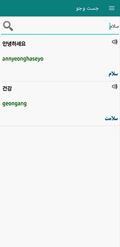

## Dictionary Korean

A Korean-Persian dictionary application in which the words are categorized and in each section you can see the meaning of the word, the pronunciation of that word and also the writing in Korean.
In the other section, it is possible to search based on the meaning and A Korean word itself is provided and also placed in a section of the Korean alphabet

## About program programming

This application is written in Java language and its menus are designed with navigation drower.
Application database with sqlite is a lightweight database for Android applications.
And to connect the database to Android, sqlite helper is used

         
